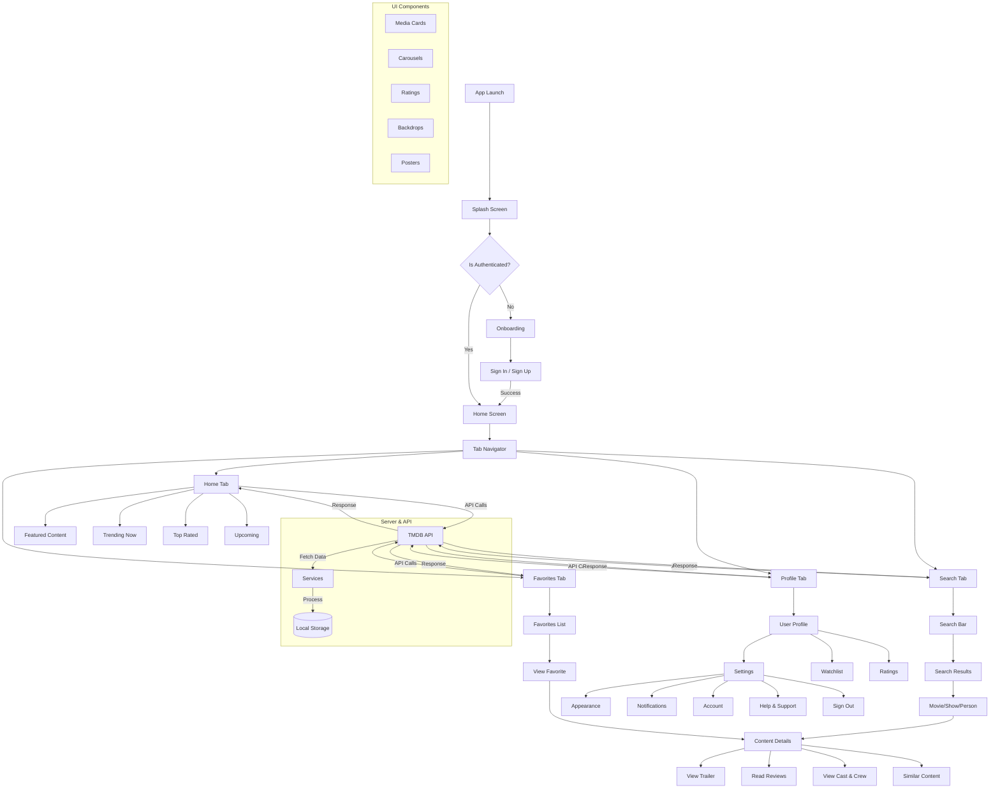

# Expo RSC Movies - Detailed Flow Diagram

## How to View

1. **VS Code**: 
   - Install the "Markdown Preview Mermaid Support" extension
   - Open this file and click the preview button (or press `Ctrl+Shift+V`)

2. **Online**:
   - Copy the Mermaid code (between the triple backticks)
   - Go to [Mermaid Live Editor](https://mermaid.live/)
   - Paste the code to see the diagram

3. **GitHub**:
   - The diagram will render automatically in GitHub markdown

## Key Components

1. **Navigation Flow**:
   - Tab-based navigation between main sections
   - Stack navigation for content details
   - Modal screens for additional actions

2. **Data Flow**:
   - API calls to TMDB for movie/show data
   - Local storage for user preferences and favorites
   - Caching for better performance

3. **UI Components**:
   - Reusable media cards
   - Responsive carousels
   - Rating components
   - Image loaders with placeholders

4. **User Flows**:
   - Browse content by categories
   - Search functionality
   - View details and related content
   - Manage favorites and watchlist
   - User profile and settings

## Dependencies
- Mermaid.js (for rendering the diagram)
- React Navigation (for app navigation)
- Expo (for cross-platform development)
- TMDB API (for movie/show data)
