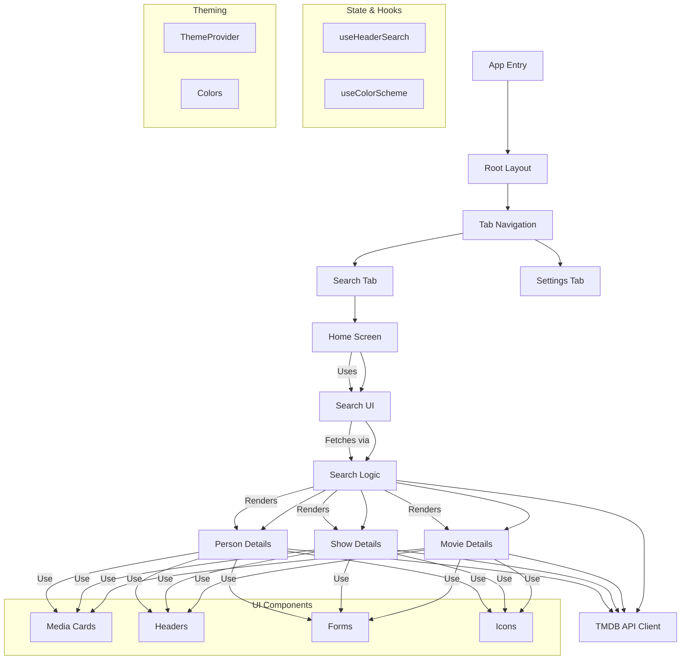

# Expo RSC Movies - Component Flow with File Mappings

## File Mappings

| Component | File Path |
|-----------|-----------|
| **App Entry** | `app/_layout.tsx` |
| **Root Layout** | `app/_layout.tsx` |
| **Tab Navigation** | `components/ui/Tabs.tsx` |
| **Search Tab** | `app/(index)/_layout.tsx` |
| **Settings Tab** | `app/(settings)/_layout.tsx` |
| **Home Screen** | `app/(index)/index.tsx` |
| **Search UI** | `app/(index)/index.tsx` (SearchPage component) |
| **Search Logic** | `hooks/useHeaderSearch.ts` |
| **Movie Details** | `app/(index)/movie/[id].tsx` |
| **Show Details** | `app/(index)/show/[id].tsx` |
| **Person Details** | `app/(index)/person/[id].tsx` |
| **TMDB API Client** | `functions/render-search.tsx` `functions/render-movie-details.tsx` `functions/render-person-details.tsx` |
| **Media Cards** | `components/MediaCard.tsx` |
| **Headers** | `components/ui/Header.tsx` |
| **Forms** | `components/ui/Form.tsx` |
| **Icons** | `components/ui/IconSymbol.tsx` `components/ui/IconSymbol.ios.tsx` |
| **useHeaderSearch** | `hooks/useHeaderSearch.ts` |
| **useColorScheme** | `hooks/useColorScheme.ts` `hooks/useColorScheme.web.ts` |
| **ThemeProvider** | `components/ui/ThemeProvider.tsx` |
| **Colors** | `@bacons/apple-colors` |