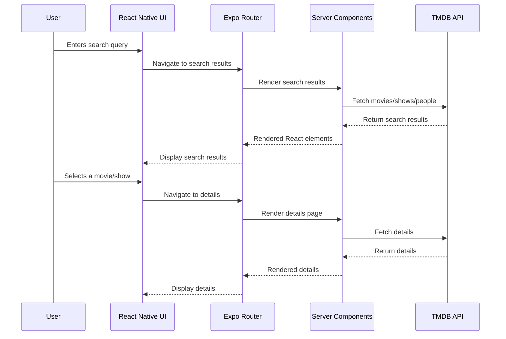

# Expo RSC Movies - Sequence Diagram

## How to View

1. **VS Code**: Install the "Markdown Preview Mermaid Support" extension and open the preview
2. **Online**: Copy the diagram code to [Mermaid Live Editor](https://mermaid.live/)
3. **GitHub**: The diagram will render automatically in GitHub markdown
4. **Local**: Use `mermaid-cli` to generate an image file

## Dependencies
- Mermaid.js (for rendering the diagram)
